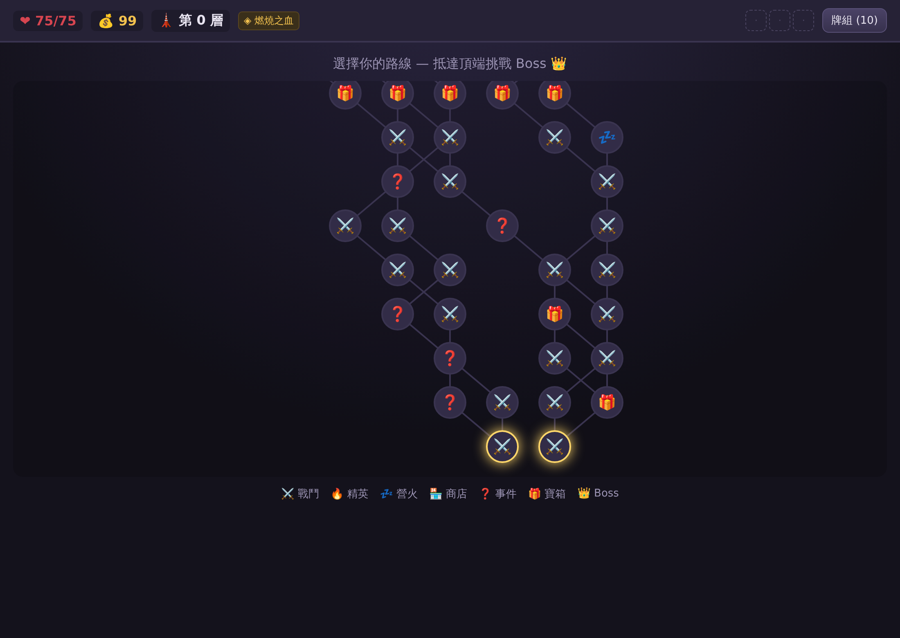
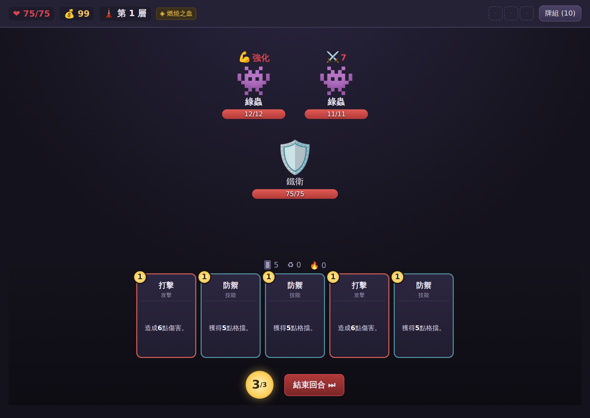

# 深淵尖塔 (Abyss Spire)

一款以《殺戮尖塔》(Slay the Spire) 為藍本、還原其核心機制的**繁體中文卡牌 Roguelike** 遊戲。
純前端（HTML / CSS / 原生 JavaScript），**免安裝、免建置**，用瀏覽器打開 `index.html` 即可遊玩。

---

## 一、玩法設計（還原自殺戮尖塔核心機制）

### 1. 遊戲循環
> 進入尖塔 → 在分支地圖上選擇路線 → 觸發戰鬥 / 事件 / 休息 / 商店 → 打贏取得卡牌 & 遺物獎勵 → 構築你的牌組 → 挑戰各層 Boss → 死亡則本局結束（Roguelike）。

每一局的**地圖、敵人、卡牌獎勵、事件皆隨機生成**。

### 2. 卡牌戰鬥系統（回合制）
- 每回合抽 **5 張**手牌，並獲得 **3 點能量**。
- 每張卡牌消耗不同**能量**才能使用；用過的卡進棄牌堆，抽牌堆抽完會把棄牌堆洗回。
- 回合結束後，手牌棄掉，換敵人行動。

### 3. 卡牌類型
| 類型 | 說明 |
|------|------|
| 攻擊 (Attack) | 對敵人造成傷害 |
| 技能 (Skill) | 獲得格擋、抽牌、施加減益等輔助效果 |
| 能力 (Power) | 打出後永久生效整場戰鬥 |
| 狀態 / 詛咒 (Status/Curse) | 佔手牌的負面卡 |

### 4. 格擋 (Block) 與防禦
技能牌可提供**格擋值**，抵免當回合傷害；格擋在自己回合開始時歸零。

### 5. 狀態效果（關鍵字）
- **力量 (Strength)**：攻擊傷害 +N（永久）
- **敏捷 (Dexterity)**：格擋 +N（永久）
- **易傷 (Vulnerable)**：受到攻擊傷害 +50%
- **虛弱 (Weak)**：造成的攻擊傷害 -25%
- **中毒 (Poison)**：回合開始損失 N 生命，之後 N-1
- **儀式 (Ritual)**：敵人每回合獲得力量

### 6. 遺物 (Relics)
提供各種被動增益（開場多抽牌、每層回血、戰鬥開場獲得格擋…）。開局有專屬遺物，戰鬥 / 精英 / 寶箱 / 商店可獲得更多。

### 7. 藥水 (Potions)
一次性消耗品，戰鬥中隨時使用（回血、爆發傷害、獲得能量等）。

### 8. 分支地圖
每層是一張**樹狀分支地圖**，節點類型：
- ⚔️ 一般戰鬥 　🔥 精英戰鬥 　💤 營火（休息 / 升級卡）
- 🏪 商店 　❓ 隨機事件 　🎁 寶箱 　👑 Boss

### 9. 卡組構築
戰鬥後可從 3 張卡中**選 1 張**加入牌組（或跳過）；營火可**升級**卡牌；商店可**購買 / 移除**卡牌。牌組不宜過肥。

### 10. 角色
- **鐵衛 (Ironclad 風格)**：高血量、力量流與格擋流，起手牌組 5×打擊、4×防禦、1×重擊。

---

## 二、程式架構

```
index.html          遊戲入口（單頁）
css/styles.css      介面樣式（暗黑尖塔風）
js/
  data.js           資料庫：卡牌 / 遺物 / 藥水 / 敵人 / 遭遇
  rng.js            可重現的隨機數（種子）
  effects.js        傷害 / 格擋 / 狀態效果核心計算
  combat.js         戰鬥引擎（回合、抽牌、出牌、敵人 AI、意圖）
  map.js            分支地圖生成與導航
  ui.js             畫面渲染
  game.js           全域狀態、存檔、流程總控（main）
```

無需 build 工具或套件，全部以 `<script>` 依序載入，掛在全域 `SPIRE` 命名空間。

## 三、遊戲畫面

| 分支地圖 | 卡牌戰鬥 |
|---|---|
|  |  |

## 四、如何遊玩
1. 直接用瀏覽器打開 `index.html`（或執行 `python3 -m http.server` 後開 `localhost:8000`）。
2. 滑鼠點卡牌打出、點敵人指定目標、按「結束回合」。
3. 進度自動存檔於瀏覽器 `localStorage`。
